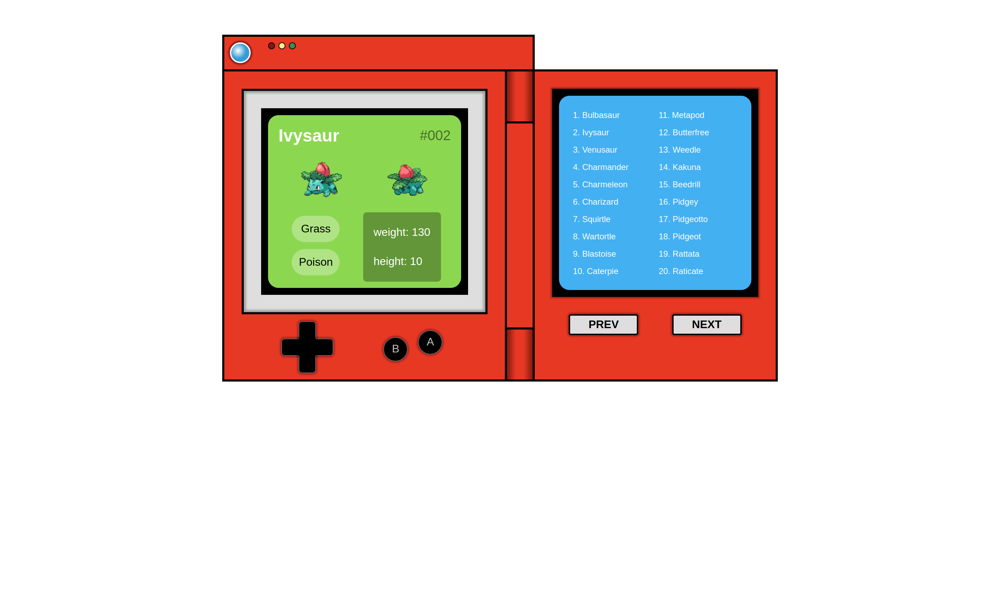

# Pokedex
This is a team project of Simplon.co BootCamp. It was developed with Web-API (https://pokeapi.co). You will discover thoudands of Pokemon here. 

    
    
    
    

    
  

## Project Link

## Technologies
- HTML
- CSS
- JavaScript (Using fetch: POST json data to Web-API)

## Guides
- Click the prev and next buttons to view thousands of Pokemon on the right screen
- Click each of Pokemon on the right screen to view a detailed information on the right screen
- Click up, down, left and right buttons to view each all of pokemons on the left and the right screen
- Click button-B to turn off the left screen and button-A to turn on the left screen

## Application Layout

